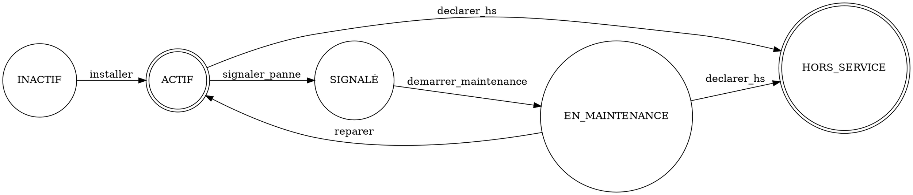
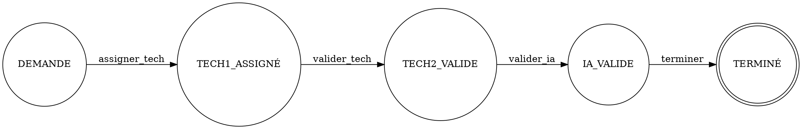
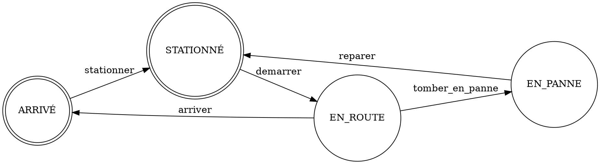

# Smart City Platform with Compilation and Generative AI

## 1. Modélisation : Automates Finis Déterministes (DFA)

### 1.1 Cycle de vie d'un Capteur
**États:** INACTIF, ACTIF, SIGNALÉ, EN_MAINTENANCE, HORS_SERVICE
**État Initial:** INACTIF
**États d'Acceptation:** ACTIF, HORS_SERVICE

#### Table de Transition
| État Courant | Événement | État Suivant |
|--------------|-----------|--------------|
| INACTIF | installer | ACTIF |
| ACTIF | signaler_panne | SIGNALÉ |
| SIGNALÉ | demarrer_maintenance| EN_MAINTENANCE |
| EN_MAINTENANCE | reparer | ACTIF |
| EN_MAINTENANCE | declarer_hs | HORS_SERVICE |
| ACTIF | declarer_hs | HORS_SERVICE |

#### Représentation Graphviz


### 1.2 Validation d'Intervention
**États:** DEMANDE, TECH1_ASSIGNÉ, TECH2_VALIDE, IA_VALIDE, TERMINÉ
**État Initial:** DEMANDE
**États d'Acceptation:** TERMINÉ

#### Table de Transition
| État Courant | Événement | État Suivant |
|--------------|-----------|--------------|
| DEMANDE | assigner_tech | TECH1_ASSIGNÉ |
| TECH1_ASSIGNÉ | valider_tech | TECH2_VALIDE |
| TECH2_VALIDE | valider_ia | IA_VALIDE |
| IA_VALIDE | terminer | TERMINÉ |

#### Représentation Graphviz


### 1.3 Trajet d'un Véhicule Autonome
**États:** STATIONNÉ, EN_ROUTE, EN_PANNE, ARRIVÉ
**État Initial:** STATIONNÉ
**États d'Acceptation:** ARRIVÉ, STATIONNÉ

#### Table de Transition
| État Courant | Événement | État Suivant |
|--------------|-----------|--------------|
| STATIONNÉ | demarrer | EN_ROUTE |
| EN_ROUTE | tomber_en_panne | EN_PANNE |
| EN_PANNE | reparer | STATIONNÉ |
| EN_ROUTE | arriver | ARRIVÉ |
| ARRIVÉ | stationner | STATIONNÉ |

#### Représentation Graphviz


## 2. Compilateur Langage Naturel vers SQL (NL to SQL)

### Grammaire Formelle (EBNF)

La grammaire formelle utilisée par notre analyseur syntaxique pour analyser les requêtes en langage naturel :

```ebnf
<query> ::= <select_statement> | <count_statement>

<select_statement> ::= ("Affiche" | "Montre" | "Donne-moi" | "Quels") <columns> "de" <table_name> [<where_clause>] [<order_clause>] [<limit_clause>]

<count_statement> ::= "Combien de" <table_name> [<where_clause>]

<columns> ::= "*" | <column_name> ("," <column_name>)* | <aggregation>

<table_name> ::= "zones" | "capteurs" | "citoyens" | "interventions" | "vehicules" | "mesures"

<where_clause> ::= ("qui" | "dont" | "sont" | "ayant") <condition> ("et" <condition>)*

<condition> ::= <column_name> <operator> <value> | "hors service" | "les dernières 24 heures"

<operator> ::= ">" | "<" | "=" | "!=" | "sont"

<order_clause> ::= "les plus" <adjective> | "le plus" <adjective>

<limit_clause> ::= "les" NUMBER "premiers" | NUMBER
```

Exemples supportés :
1. "Affiche les 5 zones les plus polluées" -> `SELECT localisation FROM capteurs ORDER BY pollution_index DESC LIMIT 5`
2. "Combien de capteurs sont hors service ?" -> `SELECT COUNT(*) FROM capteurs WHERE etat = 'HORS_SERVICE'`
3. "Quels citoyens ont un score écologique > 80 ?" -> `SELECT nom FROM citoyens WHERE score_ecologique > 80`
4. "Montre les mesures des dernières 24 heures" -> `SELECT time_bucket('1 hour', time) AS bucket, avg(valeur) FROM mesures WHERE time > NOW() - INTERVAL '24 hours' GROUP BY bucket ORDER BY bucket DESC`
